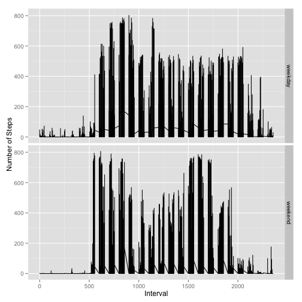

## Loading and preprocessing the data

```r
# Import library
library(knitr)
library(plyr)
library(lattice)
library(ggplot2)

# Read date file
data <- read.csv("activity.csv", head=TRUE)
# Subset complete cases
complete.case <- na.omit(data)
```


## What is mean total number of steps taken per day?

```r
# Calculate total number of steps taken each day
total.number <- aggregate(complete.case$steps, by = list(category=complete.case$date), FUN = sum)

# Create a histogram of total number following the Freedman-Diaconis rule to determine breaks
hist(total.number$x, breaks="FD", xlab="total steps",main="Histogram of Total Steps")
```

 

```r
# Calculate the mean and median total number of steps taken each day
summary <- summary(total.number$x)

# Report the median of total number of steps taken each day
print(summary[3],type="html")
```

```
## Median 
##  10760
```

```r
# Report the mean of total number of steps taken each day
print(summary[4],type="html")
```

```
##  Mean 
## 10770
```

## What is the average daily activity pattern?

```r
# Calculate the average number of steps 
attach(complete.case)
pattern <- aggregate(steps ~ interval, FUN = mean)
names(pattern) <- c("interval","mean")
detach(complete.case)

# Create time series plot 
plot(pattern$mean ~ pattern$interval, type="l", 
     main="Average Daily Activity", xlab="5-minute intervals",ylab="Average Steps")
```

 

```r
# Which 5-minute interval has the max number of steps? 
loc <- which(pattern==max(pattern$mean), arr.ind=TRUE)
max.interval <- pattern[loc[1],]$interval
phrase <- paste("The ", max.interval," interval contains the maximum average number of steps")
print(phrase, type="html")
```

```
## [1] "The  835  interval contains the maximum average number of steps"
```

## Imputing missing values

```r
# total number of missing values
sum(is.na(data$steps))
```

```
## [1] 2304
```

```r
# Use means of 5-minute intervals to impute missing values

data.new <- join(data,pattern,by="interval",type="left")
na.list <- is.na(data.new$steps)
data.new$steps[na.list] <- data.new$mean[na.list]

# Calculate total number of steps taken each day
total.number <- aggregate(data.new$steps, by = list(category=data.new$date), FUN = sum)

# Create a histogram of total number following the Freedman-Diaconis rule to determine breaks
hist(total.number$x, breaks="FD", xlab="total steps",main="Histogram of Total Steps")
```

 

```r
# Calculate the mean and median total number of steps taken each day
summary <- summary(total.number$x)

# Report the median of total number of steps taken each day
print(summary[3],type="html")
```

```
## Median 
##  10770
```

```r
# Report the mean of total number of steps taken each day
print(summary[4],type="html")
```

```
##  Mean 
## 10770
```
**Do these values differ from the estimates from the first part of the assignment?**
- The median (10770) of imputing missing dataset is slightly greater than that (10760) of complete cases.
- However, the means of the two datasets are the same (10770). 

**What is the impact of imputing missing data on the estimates f the total daily number of steps?**
- Judging from the differences in means and medians between these two datasets, it seems that the impact of imputing missing data is minor, which might be attributed to the fact that the averages of 5-minute intervals are used to impute missing values. 


## Are there differences in activity patterns between weekdays and weekends?

```r
# Use weekdays() to find the day of the week
data.new$day <- weekdays(as.Date(data.new$date))

# Convert days to weekend or Weekdays
conversion <- function(x) ifelse(x %in% c("Saturday", "Sunday"), "weekend", "weekday")
data.new$week <- conversion(data.new$day)

# Calculate the average number of steps 
series <- tapply(data.new$steps, data.new$interval, mean)

# Create time series plot 
g <- ggplot(data.new,aes(data.new$interval, data.new$steps)) 
g <- g + geom_line()
g <- g + labs(x="Interval",y="Number of Steps")
g <- g + facet_grid(week~.)
g 
```

 
